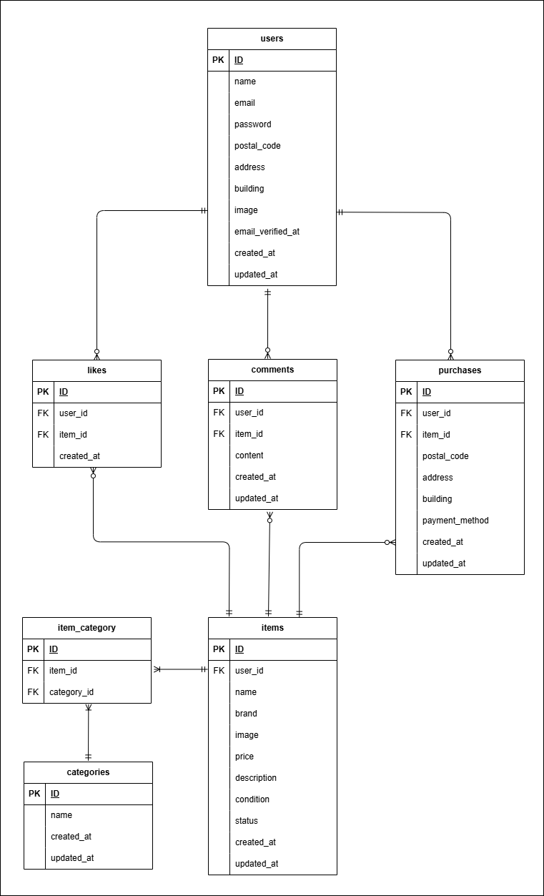

# フリマアプリ

## 環境構築

### Dockerビルド

1. GitHubからリポジトリをクローン
```bash
git clone git@github.com:ami-takaoka/flea-market-app.git
```

2. Docker Desktopを起動する

3. プロジェクトディレクトリへ移動
```bash
cd flea-market-app
```

4. Dockerコンテナをビルド・起動
```bash
docker-compose up -d --build
```

※ MacのM1・M2チップのPCの場合、`no matching manifest for linux/arm64/v8 in the manifest list entries`のメッセージが表示されビルドができないことがあります。
エラーが発生する場合は、docker-compose.ymlファイルの「mysql」内に「platform」の項目を追加で記載してください

```bash
mysql:
    platform: linux/x86_64
    image: mysql:8.0.26
    environment:
```

### Laravel環境構築

1. PHPコンテナに入る
```bash
docker-compose exec php bash
```

2. 依存関係をインストール
```bash
composer install
```
※ Laravelの権限エラーが出た場合
```bash
sudo chmod -R 777 src/*
```

3. .envファイル作成
```bash
cp .env.example .env
```
.envを以下のように変更してください

※ .env はホスト側（VSCode）で編集してください

```
DB_HOST=mysql
DB_DATABASE=laravel_db
DB_USERNAME=laravel_user
DB_PASSWORD=laravel_pass

MAIL_MAILER=smtp
MAIL_HOST=mailhog
MAIL_PORT=1025
MAIL_USERNAME=null
MAIL_PASSWORD=null
MAIL_ENCRYPTION=null
MAIL_FROM_ADDRESS=test@example.com
MAIL_FROM_NAME="${APP_NAME}"

STRIPE_KEY=
STRIPE_SECRET=
```
※ Stripe決済機能を利用する場合は、Stripeアカウントを作成し、
取得したAPIキーを `.env` に設定してください。

※ 権限エラーが出た場合
```bash
sudo chown -R $USER:$USER .
```

4. アプリケーションキー生成
```bash
php artisan key:generate
```

5. 設定キャッシュ削除
```bash
php artisan config:clear
```

6. マイグレーション実行
```bash
php artisan migrate --seed
```

7. ストレージリンク作成
```bash
php artisan storage:link
```

8. アプリ確認
```
http://localhost
```

9. Mailhog確認 
```
http://localhost:8025
```

## ダミーデータ

Seeder実行により以下のデータが登録されます。

- ユーザー情報
- 商品情報
- カテゴリ情報

## 使用技術(実行環境)

- PHP 8.3.0
- Laravel 8.83.27
- MySQL 8.0.26
- Nginx
- Docker
- Docker Compose
- Mailhog
- Stripe Checkout 20.2.0
- HTML
- CSS
- JavaScript

## テスト

PHPUnitを使用しています。

### テスト実行
```bash
php artisan test
```

### テスト内容

- 会員登録機能
- ログイン機能
- ログアウト機能
- 商品一覧表示機能
- いいね機能
- コメント機能
- 購入機能
- プロフィール編集機能
- 出品機能
- メール認証機能

## ER図



## URL

- 開発環境：http://localhost/
- phpMyAdmin：http://localhost:8080/
- Mailhog：http://localhost:8025/
